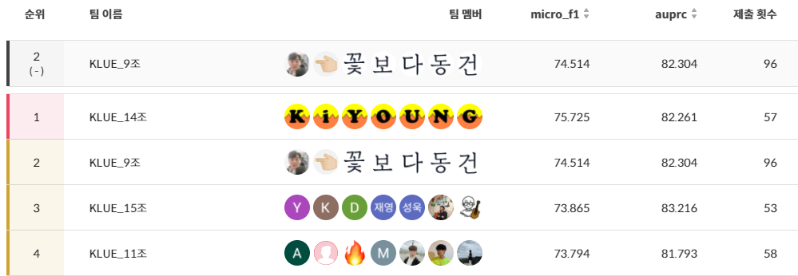

# KLUE Relation Extraction Competition, Naver Boostcamp AI Tech 2기
## Competition Abstract
🤗 KLUE RE(Relation Extraction) Dataset으로 주어진 문장의 지정된 두 Entity의 관계를 추출, 분류하는 Task.  
🤗 Public, Private 데이터가 분리된 Leaderboard 평가가 이루어짐.  
🤗 하루 10회로 모델 제출 제한

## [Competition Report(PDF)](competiton_results/boostcamp-nlp-9.pdf)
## Our solutions
- 'klue/roberta-large' with BiLSTM
- Modify Input format
  - Typed Entity Marker with Punctuation 
  - Add Query like Question and Answering
- Augmentation
  - Subject & Object Entity Random Masking
  - AEDA
  - Random Delete
  - Entity swap
- Ensemble
  - Stratified K-Fold & OOF(Out-of-Fold) Prediction
  - K-fold Ensemble via weighted soft voting

## 최종 순위 2등!


--- 
## Docs 
- Model docs
  - [Developed models](models\README.md)
- Augmentation docs
  - [Task Adaptive Pre-Training via Back translation](./augmentation/back_trans/README.md)
  - [EDA](./augmentation/README.md#eda)
  - [AEDA](./augmentation/README.md#aeda)
  - [Random masking](./augmentation/README.md#random-masking)

## Quickstart
### Installation
```
pip install -r requirements.txt
```
### Train model
```python
# default wandb setting in train.py
run = wandb.init(project= 'klue', entity= 'quarter100', name= f'KFOLD_{fold}_{args.wandb_path}')
```

```
python train.py
```
Models are saved in "./best_model/".
### Inference
```
python inference_fold.py
```
Prediction csv files are saved in "./prediction".
### Ensemble
```
python vote.py
```
Ensemble result is saved in "./prediction/submission_fold_total.csv".
