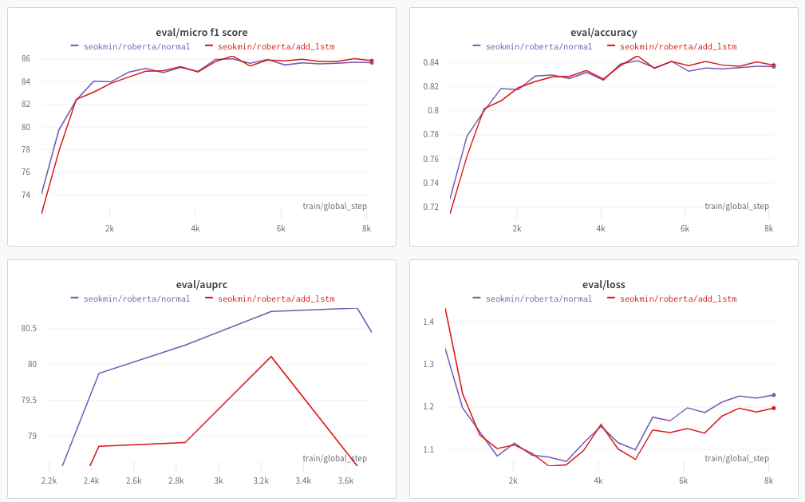

# klue-level2-nlp-09


## 코드 사용 GUIDE

### add_token_ver

1. 자신의 코드에 load_data에 있는 load_data, tokenized_dataset 함수를 변경해주세요 !
2. Train.py, inference.py에 doc string으로 추가한 부분이라고 명시한 부분을 추가해주세요 ! 추가한 부분은 아래와 같으며 모델 생성하는 부분에서 추가를해줬습니다. (추가한 special token의 개수만큼 embedding 차원 수를 맞춰주는 내용입니다.)

``` python
  model.resize_token_embeddings(tokenizer.vocab_size + 4)
```


### add_lstm_ver

- 사용 방법은 그냥 train.py를 돌리시면 됩니다.

저희가 기존에 사용하는 모델을 AutoModel만 가져와서 뒤에 LSTM layer를 추가해준 다음 설계한 모델로 돌렸습니다.

lstm의 마지막 hidden layer input을 concat하여 fc layer에 넣어주어 분류를 하는 방식으로 적용을 했습니다. (이 방법이 맞는지 모르겠어 아시는 분 있으면 피드백 부탁드려요 ! )

아래 그래프에서 보라색이 LSTM을 추가하지 않은 모델, 빨간색이 LSTM을 추가한 모델입니다. LSTM이 eval/loss 측면에서는 조금 더 안정적인 것 같은데 아직 제출을 해보지 않아 어떤 것이 좋은지는 아직 잘 모르겠습니다.




추가로 제가 또 변경한 부분이 있는데 load_data.tokenized_dataset 부분입니다. 기존에 SUB_ENT + [SEP] + OBJ_ENT 방식으로 문장을 넣어줬던 방법을 SUB_ENT + '와' + OBJ_ENT + '의 관계' 로 넣어주어 한국어 모델로 학습된 모델이니까 관계라는 단어도 이해하지 않을까라는 생각에 위의 두 실험에도 이 방법을 추가하였습니다. 아직 이 방법이 좋은 방법인지는 실험 중에 있습니다.

Training_Args 부분을 보시면 label_smoothing_factor 옵션을 주어 label smoothing 을 사용했습니다


REF

https://stackoverflow.com/questions/65205582/how-can-i-add-a-bi-lstm-layer-on-top-of-bert-model?rq=1